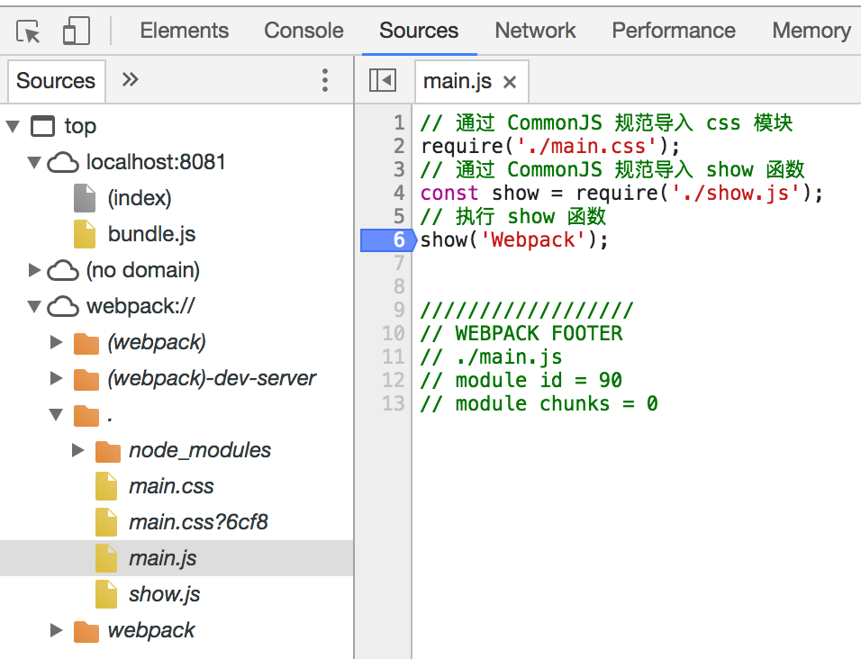

# webpack

`Webpack` 是一个打包模块化 JavaScript 的工具，在 `Webpack` 里一切文件皆模块，**通过 Loader 转换文件，通过 Plugin 注入钩子**，最后输出由多个模块组合成的文件。`Webpack` 专注于构建模块化项目。
```js
module.exports = {
  // 所有模块的入口，webpack 从入口开始递归解析出所有依赖的模块
  entry: './app.js',
  output: {
    // 把入口依赖的所有模块打包成一个文件 bundle.js 输出
    filename: 'bundle.js'
  }
}
```
Webpack优点
* 专注于处理模块化的项目，能做到开箱机用一步到位
* 通过Plugin扩展，完整好用又不失灵活
* 使用场景不仅限于Web开发
* 社区庞大活跃，经常引入紧跟时代发展的新特性，能为大多数场景找到已有的开源扩展
* 良好的开发体验

Webpack缺点是只能用于采用模块化开发的项目。

## Npm Script
`Npm Script` 是一个任务执行者。`Npm` 是在安装 `Node.js` 时附带的包管理器，`Npm Script` 则是 `Npm` 内置的一个功能，允许在 `package.json` 文件里面使用 `scripts` 字段定义任务：
```js
{
  scripts: {
    "dev": "node dev.js",
    "pub": "node build.js"
  }
}
```
里面的`scripts`字段是一个对象，每个属性对应一段 `Shell` 脚本，以上代码定义了两个任务 `dev` 和 `pub`。 其底层实现原理是通过调用 `Shell` 去运行脚本命令，例如执行 `npm run pub` 命令等同于执行命令 `node build.js`。

## 安装Webpack到本项目

```js
// npm i -D 是 npm install --save-dev 的简写，是指安装模块并保存到 package.json 的 devDependencies
// 安装最新稳定版
npm i -D webpack

// 安装指定版本
npm i -D webpack@<version>

// 安装最新体验版本
npm i -D webpack@beta
```

安装完后你可以通过这些途径运行安装到本项目的 Webpack：

* 在项目根目录下对应的命令行里通过 node_modules/.bin/webpack 运行 Webpack 可执行文件。
* 在 Npm Script 里定义的任务会优先使用本项目下的 Webpack，代码如下：
```js
"scripts": {
    "start": "webpack --config webpack.config.js"
}
```
## 使用Webpack
页面入口文件`index.html`

```html
<html>
<head>
  <meta charset="UTF-8">
</head>
<body>
<div id="app"></div>
<!--导入 Webpack 输出的 JavaScript 文件-->
<script src="./dist/bundle.js"></script>
</body>
</html>
```

JS 工具函数文件 `show.js`

```js
// 操作 DOM 元素，把 content 显示到网页上
function show(content) {
  window.document.getElementById('app').innerText = 'Hello,' + content;
}

// 通过 CommonJS 规范导出 show 函数
module.exports = show;
```
JS 执行入口文件`main.js`
```js
// 通过 CommonJS 规范导入 show 函数
const show = require('./show.js');
// 执行 show 函数
show('Webpack');
```
Webpack在执行构建时默认会从项目根目录下的 `webpack.config.js `文件读取配置，所以你还需要新建它，其内容如下：
```js
const path = require('path');

module.exports = {
  // JavaScript 执行入口文件
  entry: './main.js',
  output: {
    // 把所有依赖的模块合并输出到一个 bundle.js 文件
    filename: 'bundle.js',
    // 输出文件都放到 dist 目录下
    path: path.resolve(__dirname, './dist'),
  }
};
```
由于 Webpack 构建运行在 Node.js 环境下，所以该文件最后需要通过 CommonJS 规范导出一个描述如何构建的 Object 对象。
此时项目目录如下：
```js
|-- index.html
|-- main.js
|-- show.js
|-- webpack.config.js
```
一切文件就绪，在项目根目录下执行 `webpack` 命令运行 Webpack 构建，你会发现目录下多出一个 `dist` 目录，里面有个 `bundle.js` 文件， `bundle.js` 文件是一个可执行的 `JavaScript` 文件，它包含页面所依赖的两个模块 `main.js` 和 `show.js` 及内置的 `webpackBootstrap` 启动函数。 这时你用浏览器打开 `index.html` 网页将会看到 `Hello,Webpack`。

Webpack 是一个打包模块化 JavaScript 的工具，它会从 `main.js` 出发，识别出源码中的模块化导入语句， 递归的寻找出入口文件的所有依赖，把入口和其所有依赖打包到一个单独的文件中。 从 Webpack2 开始，已经内置了对 ES6、CommonJS、AMD 模块化语句的支持。

## 使用Loader
在上一节中使用Webpack构建了一个采用CommonJS规范的模块化项目。
Webpack不原生支持解析CSS文件。要支持非JavaScript类型的文件，需要使用Webpack的Loader机制。Webpack的配置修改如下：
```js
const path = require('path');

module.exports = {
  // JavaScript 执行入口文件
  entry: './main.js',
  output: {
    // 把所有依赖的模块合并输出到一个 bundle.js 文件
    filename: 'bundle.js',
    // 输出文件都放到 dist 目录下
    path: path.resolve(__dirname, './dist'),
  },
  module: {
    rules: [
      {
        // 用正则去匹配要用该loader转换的CSS文件
        test: /\.css$/,
        use: ['style-loader', 'css-loader?minimize'],
      }
    ]
  }
}
```
Loader可以文件转换，配置里的 `module.rules` 数组配置了一组规则，告诉 Webpack 在遇到哪些文件时使用哪些 Loader 去加载和转换。
如上配置告诉 Webpack 在遇到以 `.css` 结尾的文件时先使用 `css-loader` 读取 CSS 文件，再交给 `style-loader` 把 CSS 内容注入到 JavaScript 里。
在配置Loader时需要注意：
* `use`属性的值需要是一个由 Loader 名称组成的数组，Loader 的执行顺序是由后到前的；
* 每一个 Loader 都可以通过 URL querystring 的方式传入参数，例如 `css-loader?minimize` 中的 `minimize` 告诉 `css-loader` 要开启 CSS 压缩。

在重新执行 Webpack 构建前要先安装新引入的 Loader：

`npm i -D style-loader css-loader`

安装成功后重新执行构建时，你会发现 `bundle.js` 文件被更新了，里面注入了在 `main.css` 中写的 CSS，而不是会额外生成一个 CSS 文件。 第一次看到 CSS 被写在了 JavaScript 里！这其实都是 `style-loader` 的功劳，它的工作原理大概是把 CSS 内容用 JavaScript 里的字符串存储起来， 在网页执行 JavaScript 时通过 DOM 操作动态地往 `HTML head` 标签里插入 `HTML style` 标签。 也许你认为这样做会导致 JavaScript 文件变大并导致加载网页时间变长，想让 Webpack 单独输出 CSS 文件。下一节 [1-5 使用Plugin](http://webpack.wuhaolin.cn/1%E5%85%A5%E9%97%A8/1-5%E4%BD%BF%E7%94%A8Plugin.html) 将教你如何通过 Webpack Plugin 机制来实现。

给 Loader 传入属性的方式除了有 `querystring` 外，还可以通过 Object 传入，以上的 Loader 配置可以修改为如下：
```js
use: [
  'style-loader',
  {
    loader: 'css-loader',
    options: {
      minimize:true,
    }
  }
]
```
除了在 `webpack.config.js` 配置文件中配置 Loader 外，还可以在源码中指定用什么 Loader 去处理文件。 以加载 CSS 文件为例，修改上面例子中的 `main.js` 如下：
```js
require('style-loader!css-loader?minimize!./main.css');
```
这样就能指定对 `./main.css` 这个文件先采用 css-loader 再采用 style-loader 转换。

## 使用Plugin
Plugin 是用来扩展 Webpack 功能的，通过在构建流程里注入钩子实现，它给 Webpack 带来了很大的灵活性。
在上一节中通过 Loader 加载了 CSS 文件，**本节将通过 Plugin 把注入到 `bundle.js` 文件里的 CSS 提取到单独的文件中，配置修改如下：**
```js
const path = require('path');
const ExtractTextPlugin = require('extract-text-webpack-plugin'); // new add

module.exports = {
  // JavaScript 执行入口文件
  entry: './main.js',
  output: {
    // 把所有依赖的模块合并输出到一个 bundle.js 文件
    filename: 'bundle.js',
    // 把输出文件都放到 dist 目录下
    path: path.resolve(__dirname, './dist'),
  },
  module: {
    rules: [
      {
        // 用正则去匹配要用该 loader 转换的 CSS 文件
        test: /\.css$/,
        use: ExtractTextPlugin.extract({ // modified
          // 转换 .css 文件需要使用的 Loader
          use: ['css-loader'],
        }),
      }
    ]
  },
  plugins: [ // new add
    new ExtractTextPlugin({
      // 从 .js 文件中提取出来的 .css 文件的名称
      filename: `[name]_[contenthash:8].css`,
    }),
  ]
};
```
要让以上代码运行起来，需要先安装新引入的插件：

```js
npm i -D extract-text-webpack-plugin
```

安装成功后重新执行构建，你会发现 `dist` 目录下多出一个 `main_1a87a56a.css` 文件，`bundle.js` 里也没有 CSS 代码了，再把该 CSS 文件引入到 `index.html` 里就完成了。

从以上代码可以看出， Webpack 是通过 `plugins` 属性来配置需要使用的插件列表的。 `plugins` 属性是一个数组，**里面的每一项都是插件的一个实例，在实例化一个组件时可以通过构造函数传入这个组件支持的配置属性**。

例如 `ExtractTextPlugin` 插件的作用是提取出 JavaScript 代码里的 CSS 到一个单独的文件。 对此你可以通过插件的 `filename` 属性，告诉插件输出的 CSS 文件名称是通过 `[name]_[contenthash:8].css` 字符串模版生成的，里面的 `[name]` 代表文件名称， `[contenthash:8]` 代表根据文件内容算出的8位 `hash` 值， 还有很多配置选项可以在 ExtractTextPlugin 的主页上查到。

## 使用DevServer
实际开发需要：
1. 提供HTTP服务而不是使用本地文件预览
2. 监听文件变化并自动刷新网页，做到实时预览
3. 支持Source Map,以方便调试

对于这些， Webpack 都为你考虑好了。Webpack 原生支持上述第2、3点内容，再结合官方提供的开发工具 **DevServer** 也可以很方便地做到第1点。 DevServer 会启动一个 HTTP 服务器用于服务网页请求，同时会帮助启动 Webpack ，并接收 Webpack 发出的文件更变信号，通过 WebSocket 协议自动刷新网页做到实时预览。

首先需要安装 DevServer：
```js
npm i -D webpack-dev-server
```
安装成功后执行 `webpack-dev-server` 命令， DevServer 就启动了，这时你会看到控制台有一串日志输出：
```js
Project is running at http://localhost:8080/
webpack output is served from /
```
这意味着 DevServer 启动的 HTTP 服务器监听在 http://localhost:8080/ ，DevServer 启动后会一直驻留在后台保持运行，访问这个网址你就能获取项目根目录下的 `index.html`。 用浏览器打开这个地址你会发现页面空白错误原因是 `./dist/bundle.js` 加载404了。 同时你会发现并没有文件输出到 `dist` 目录，**原因是 DevServer 会把 Webpack 构建出的文件保存在内存中，在要访问输出的文件时，必须通过 HTTP 服务访问。** 由于 DevServer 不会理会 `webpack.config.js` 里配置的 `output.path `属性，所以要获取 `bundle.js` 的正确 URL 是 http://localhost:8080/bundle.js，对应的 index.html 应该修改为：

```html
<html>
<head>
  <meta charset="UTF-8">
</head>
<body>
<div id="app"></div>
<!--导入 DevServer 输出的 JavaScript 文件  modified-->
<script src="bundle.js"></script>
</body>
</html>
```
### 实时预览
接着上面的步骤，你可以试试修改 `main.js main.css show.js` 中的任何一个文件，保存后你会发现浏览器会被自动刷新，运行出修改后的效果。

Webpack 在启动时可以开启监听模式，开启监听模式后 Webpack 会监听本地文件系统的变化，发生变化时重新构建出新的结果。Webpack 默认是关闭监听模式的，你可以在启动 Webpack 时通过 `webpack --watch` 来开启监听模式。

通过 DevServer 启动的 Webpack 会开启监听模式，当发生变化时重新执行完构建后通知 DevServer。 DevServer 会让 Webpack 在构建出的 JavaScript 代码里注入一个代理客户端用于控制网页，网页和 DevServer 之间通过 WebSocket 协议通信， 以方便 DevServer 主动向客户端发送命令。 DevServer 在收到来自 Webpack 的文件变化通知时通过注入的客户端控制网页刷新。

如果尝试修改 `index.html` 文件并保存，**你会发现这并不会触发以上机制**，导致这个问题的原因是 Webpack 在启动时会以配置里的 `entry` 为入口去递归解析出 `entry` 所依赖的文件，只有 `entry` 本身和依赖的文件才会被 Webpack 添加到监听列表里。 而 `index.html` 文件是脱离了 JavaScript 模块化系统的，所以 Webpack 不知道它的存在。

### 模块热替换
除了通过重新刷新整个网页来实现实时预览，DevServer 还有一种被称作模块热替换的刷新技术。 模块热替换能做到在不重新加载整个网页的情况下，通过将被更新过的模块替换老的模块，再重新执行一次来实现实时预览。 模块热替换相对于默认的刷新机制能提供更快的响应和更好的开发体验。 模块热替换默认是关闭的，要开启模块热替换，你只需在启动 DevServer 时带上 `--hot` 参数，重启 DevServer 后再去更新文件就能体验到模块热替换的神奇了。


### 支持 Source Map
在浏览器中运行的 JavaScript 代码都是编译器输出的代码，这些代码的可读性很差。如果在开发过程中遇到一个不知道原因的 Bug，则你可能需要通过断点调试去找出问题。 在编译器输出的代码上进行断点调试是一件辛苦和不优雅的事情， 调试工具可以通过 Source Map 映射代码，让你在源代码上断点调试。 Webpack 支持生成 Source Map，只需在启动时带上 `--devtool source-map` 参数。 加上参数重启 DevServer 后刷新页面，再打开 Chrome 浏览器的开发者工具，就可在 Sources 栏中看到可调试的源代码了。


```js
{
  "name": "dive-into-webpack",
  "version": "1.0.0",
  "scripts": {
    "build": "webpack-dev-server --hot --devtool source-map" // modified --hot --devtool source-map
  },
  "dependencies": {},
  "devDependencies": {
    "css-loader": "^0.28.4",
    "style-loader": "^0.18.2",
    "webpack": "^3.4.0",
    "webpack-dev-server": "^2.6.1" // new add
  }
}
```
## 核心概念
Webpack 有以下几个核心概念：
* Entry： 入口，Webpack 执行构建的第一步将从 Entry 开始，可抽象成输入。
* Module：模块， 在 Webpack 里一切皆模块，一个模块对应着一个文件。Webpack 会从配置的 Entry 开始递归找出所有依赖的模块。
* Chunk: 代码块，一个Chunk由多个模块组合而成，用于代码合并与分割。
* Loader: 模块转换器， 用于把模块原内容按照需求转换成新内容。
* Plugin：扩展插件，在 Webpack 构建流程中的特定时机注入扩展逻辑来改变构建结果或做你想要的事情。
* Output：输出结果，在Webpack经过一系列处理并得出最终想要的代码后输出结果。

Webpack 启动后会从 Entry 里配置的 Module 开始递归解析 Entry 依赖的所有 Module。 每找到一个 Module， 就会根据配置的 Loader 去找出对应的转换规则，对 Module 进行转换后，再解析出当前 Module 依赖的 Module。 这些模块会以 Entry 为单位进行分组，一个 Entry 和其所有依赖的 Module 被分到一个组也就是一个 Chunk。最后 Webpack 会把所有 Chunk 转换成文件输出。 在整个流程中 Webpack 会在恰当的时机执行 Plugin 里定义的逻辑。
